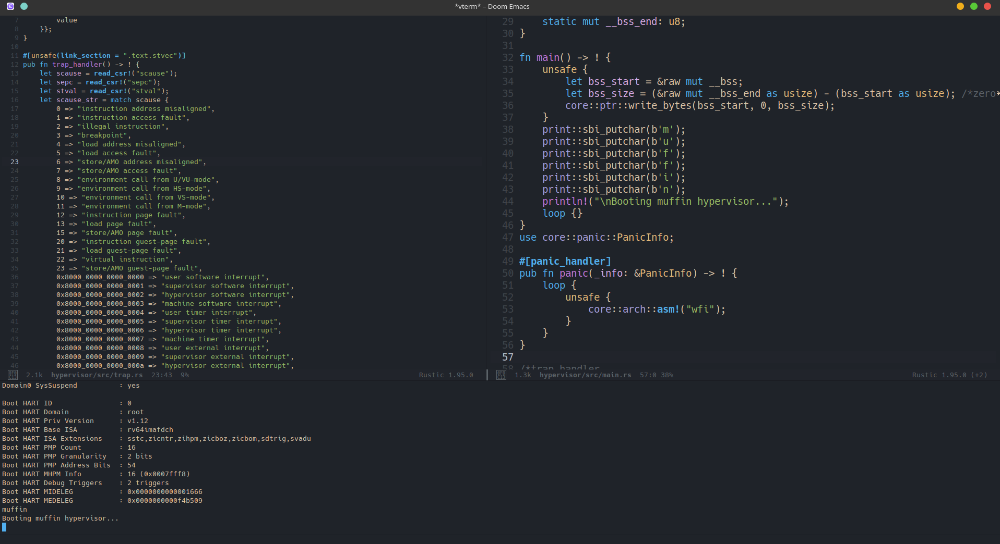

# hypervisor

A RISC-V 64 hypervisor written in Rust. Work in progress.

## Current status

Boots on QEMU riscv64 virt, prints over SBI console, and has a basic trap handler in place.

## Roadmap

Virtual memory management, interrupt virtualization, guest VM scheduling, HVC interface, and multi-vCPU support.
